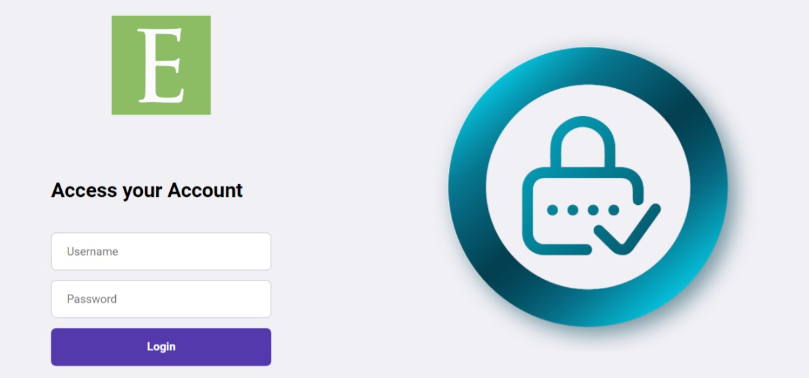
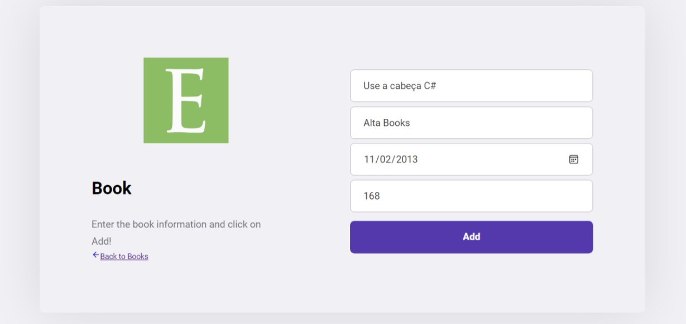
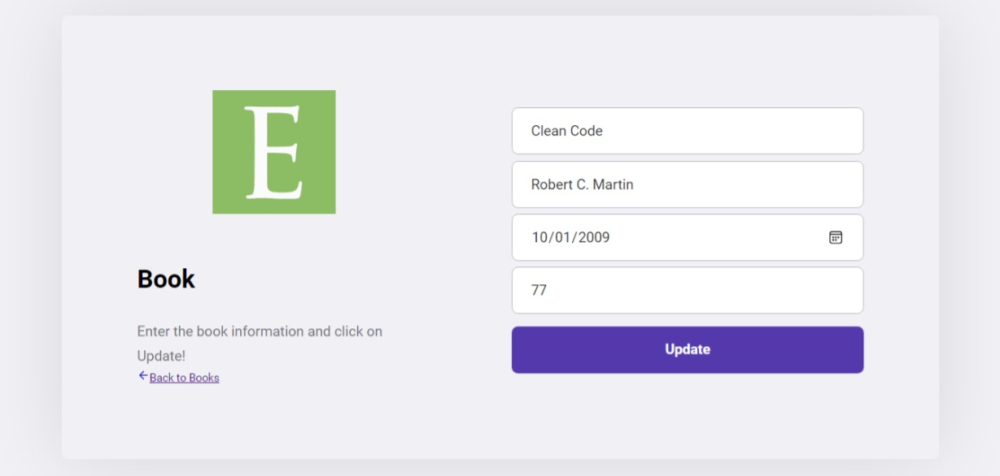
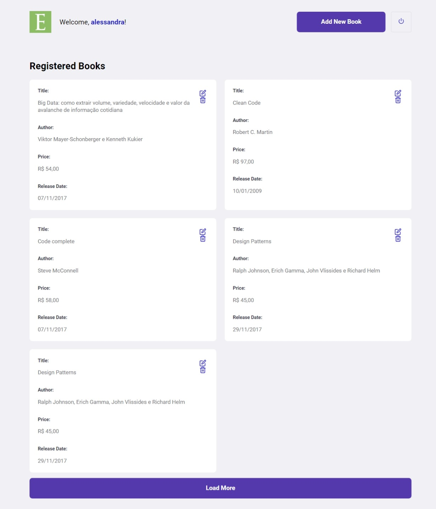

# API REST com React.js e ASP.NET Core 6

Uma Biblioteca de livros em ASP.NET Core 6 para atuar como um back-end de API e 
um projeto em React.js para atuar como interface do usuário.

## O que eu aprendi
- Remover, Atualizar, Adicionar, Mostrar os livros cadastrados;
- Lógica de paginação de APIs;
- Como consumir uma API desenvolvida em ASP.NET Core 6 com React JS
- Conceitos fundamentais de React JS e SPA's (Single Page Applications)
- O que são componentes React, JSX, propriedade, estado, imutabilidade e mais
- Montar um layout do zero
- Como consumir API's com React JS e Axios
- As boas práticas a se adotar ao consumir API's no React
- Noções de Open API(Swagger)
- Noções de Postman

## Tecnologias utilizadas como:

- React JS;

- Axios;

- ASP.NET Core 6;

- Postman;

- Visual Studio 2022;

- Swagger (Open API)

## Como instalar o projeto

### Clone o repositório

`git clone https://github.com/alessandradocouto/react-js-dotnet-api.git`

### Entre na pasta do projeto e instale os pacotes

`npm install`

### Execute o projeto 

`npm run dev`

#### Para saber mais sobre esse projeto: <a href="https://www.udemy.com/course/aprenda-consumir-apis-restful-em-asp-dot-net-core-6-com-react-js-axios/">Udemy</a>
